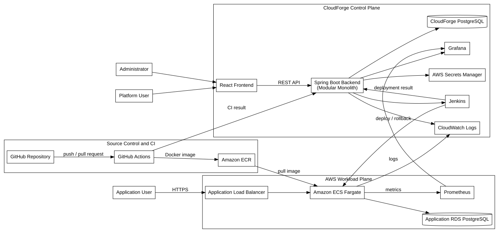
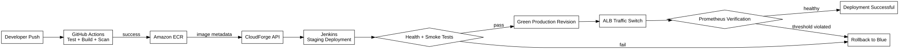

# CloudForge

CloudForge; GitHub repository’lerinde bulunan container tabanlı uygulamaların test, build, güvenlik taraması, AWS altyapı hazırlığı, staging ve production deployment, monitoring ve rollback süreçlerini otomatikleştiren self-service bir cloud deployment platformudur.

Bu proje, AWS üzerinde Infrastructure as Code, CI/CD, container orchestration, observability, güvenlik, ölçeklenebilirlik ve hata kurtarma yaklaşımlarını tek bir sistemde birleştiren kapsamlı bir bitirme projesi olarak geliştirilmektedir.

---

## Project Status

**Current Phase:** Phase 2 — System Architecture
**Current Milestone:** Milestone 1 — Project Foundation

### Completed

* [x] Project definition
* [x] Problem statement
* [x] Project scope
* [x] Project roadmap
* [x] Success criteria
* [x] Functional requirements
* [x] Non-functional requirements
* [x] User stories
* [x] Use case catalog
* [x] Requirements traceability matrix
* [x] High-level system architecture
* [x] Component catalog
* [x] Deployment sequence
* [x] Trust boundaries
* [x] Main architecture decisions
* [x] AWS network architecture
* [x] Detailed CI/CD architecture
* [x] Database ER diagram
* [x] Git branching strategy

### In Progress

- [ ] Detailed CI/CD architecture
- [ ] Database ER diagram
- [ ] Git branching strategy

### Next Phase

* Spring Boot demo application
* PostgreSQL integration
* Docker containerization
* Local Prometheus and Grafana environment

---

## Project Goal

CloudForge’un temel amacı, bir geliştiricinin GitHub repository adresini sisteme ekleyerek uygulamasını AWS üzerine güvenli ve otomatik biçimde deploy edebilmesini sağlamaktır.

Kullanıcı platform üzerinden:

1. GitHub repository adresini ekler.
2. Uygulamanın branch, port, CPU, memory ve health check ayarlarını tanımlar.
3. Repository yapılandırmasını doğrular.
4. CI pipeline üzerinden test, build ve güvenlik taraması çalıştırır.
5. Docker image’ını Amazon ECR’a gönderir.
6. Uygulamayı staging ortamına deploy eder.
7. Health ve smoke testlerinden sonra production deployment gerçekleştirir.
8. Uygulama loglarını ve metriklerini görüntüler.
9. Sorunlu sürümlerde manuel veya otomatik rollback yapar.
10. Yoğun trafik altında Auto Scaling durumunu takip eder.

---

## Academic Title

### Turkish

**AWS Üzerinde Infrastructure as Code, CI/CD, Gözlemlenebilirlik ve Otomatik Hata Kurtarma Destekli Self-Service Bulut Dağıtım Platformunun Tasarlanması ve Gerçekleştirilmesi**

### English

**Design and Implementation of a Self-Service Cloud Deployment Platform with Infrastructure as Code, CI/CD, Observability and Automated Failure Recovery on AWS**

---

## Problem Statement

Modern bir uygulamayı production ortamına taşımak yalnızca kaynak kodu bir sunucuya kopyalamaktan ibaret değildir.

Bir deployment sürecinde aşağıdaki işlemlerin güvenli ve tekrar üretilebilir biçimde gerçekleştirilmesi gerekir:

* Kaynak kod testleri
* Application build
* Docker image üretimi
* Container güvenlik taraması
* Image registry yönetimi
* Cloud infrastructure provisioning
* Network ve erişim kuralları
* Staging doğrulaması
* Production deployment
* Application monitoring
* Log yönetimi
* Secret yönetimi
* Auto Scaling
* Rollback
* Audit logging

Bu işlemler manuel gerçekleştirildiğinde hata riski artar, süreçler standartlaştırılamaz ve deployment sonuçlarının izlenmesi zorlaşır.

CloudForge, bu süreçleri merkezi ve otomatik bir platform üzerinden yönetmeyi amaçlar.

---

## High-Level Architecture



CloudForge mimarisi iki temel çalışma alanına ayrılır:

### Control Plane

CloudForge platformunun yönetim ve otomasyon katmanıdır.

```text
React Frontend
        ↓
Spring Boot Backend
        ↓
CloudForge PostgreSQL
        ↓
Jenkins / AWS / Grafana / CloudWatch
```

Control Plane aşağıdaki görevlerden sorumludur:

* Authentication ve authorization
* Uygulama kayıtlarının yönetimi
* Repository doğrulama
* Provisioning işlemlerinin başlatılması
* Jenkins pipeline entegrasyonu
* Deployment durum yönetimi
* Secret metadata yönetimi
* Alert ve audit kayıtları
* Monitoring bağlantıları

### Workload Plane

CloudForge üzerinden deploy edilen kullanıcı uygulamalarının çalıştığı AWS ortamıdır.

```text
Application Load Balancer
        ↓
Amazon ECS Fargate
        ↓
Application Database
```

Her deploy edilen uygulama bağımsız ECS service olarak çalışacaktır.

---

## Deployment Workflow



Temel deployment akışı:

```text
Developer Push
      ↓
GitHub Repository
      ↓
GitHub Actions
      ↓
Test + Build + Security Scan
      ↓
Amazon ECR
      ↓
CloudForge Backend
      ↓
Jenkins
      ↓
Staging Deployment
      ↓
Health Check + Smoke Test
      ↓
Production Blue-Green Deployment
      ↓
Prometheus Verification
      ↓
Success veya Rollback
```

---

## CI/CD Responsibilities

GitHub Actions ve Jenkins aynı işleri tekrarlamayacaktır.

### GitHub Actions — Continuous Integration

GitHub Actions aşağıdaki görevlerden sorumludur:

* Source code checkout
* Unit test
* Integration test
* Maven veya ilgili build işlemi
* Docker image build
* Vulnerability scanning
* Amazon ECR authentication
* Docker image push
* Build sonucunun CloudForge’a bildirilmesi

### Jenkins — Continuous Deployment

Jenkins aşağıdaki görevlerden sorumludur:

* Terraform validation, plan ve apply
* Application infrastructure provisioning
* Staging deployment
* Health check
* Smoke ve integration testleri
* Production deployment
* Blue-green traffic switching
* Deployment verification
* Manual rollback
* Automatic rollback
* Sonucun CloudForge backend’e bildirilmesi

---

## Technology Stack

### Platform Development

| Area               | Technology           |
| ------------------ | -------------------- |
| Backend            | Java 21, Spring Boot |
| Frontend           | React, TypeScript    |
| Platform Database  | PostgreSQL           |
| API Documentation  | OpenAPI, Swagger     |
| Database Migration | Flyway               |
| Authentication     | Spring Security, JWT |

### DevOps and Cloud

| Area                    | Technology                |
| ----------------------- | ------------------------- |
| Cloud Provider          | AWS                       |
| Infrastructure as Code  | Terraform                 |
| Containerization        | Docker                    |
| Container Registry      | Amazon ECR                |
| Container Orchestration | Amazon ECS Fargate        |
| Load Balancing          | Application Load Balancer |
| Application Database    | Amazon RDS PostgreSQL     |
| Continuous Integration  | GitHub Actions            |
| Continuous Deployment   | Jenkins                   |
| Secret Management       | AWS Secrets Manager       |
| Logging                 | Amazon CloudWatch Logs    |
| DNS                     | Amazon Route 53           |
| TLS Certificates        | AWS Certificate Manager   |

### Observability and Testing

| Area                | Technology            |
| ------------------- | --------------------- |
| Metrics             | Prometheus            |
| Dashboards          | Grafana               |
| Load Testing        | k6                    |
| Container Scanning  | Trivy                 |
| Terraform Security  | Checkov               |
| Terraform Linting   | TFLint                |
| API Testing         | Postman / Newman      |
| Application Testing | JUnit, Testcontainers |

---

## Core Features

### Application Management

* User registration and login
* Application creation
* GitHub repository connection
* Branch and deployment configuration
* Application status management
* Application URL management

### Repository Validation

* GitHub repository address validation
* Branch validation
* Dockerfile validation
* `.cloudforge.yml` validation
* Health endpoint validation
* Metrics endpoint validation

### Infrastructure Provisioning

* ECR repository creation
* ECS service creation
* ECS task definition creation
* Target group creation
* ALB routing rule creation
* CloudWatch Log Group creation
* IAM role configuration
* Secret infrastructure configuration

### Deployment Management

* Staging deployment
* Production deployment
* Deployment history
* Deployment logs
* Commit SHA tracking
* Docker image version tracking
* Deployment status timeline

### Reliability

* Health checks
* Blue-green deployment
* Manual rollback
* Automatic rollback
* Metric-based deployment validation
* ECS Auto Scaling
* Failed task replacement

### Observability

* HTTP request rate
* HTTP error rate
* Response time
* P95 latency
* CPU usage
* Memory usage
* Running task count
* Deployment success rate
* Rollback count
* CloudWatch application logs

### Security

* GitHub Actions AWS OIDC
* IAM least privilege
* Private database access
* Secret separation
* Container vulnerability scanning
* Terraform security scanning
* Branch protection
* Webhook validation
* Audit logging

---

## Supported Application Contract

CloudForge’un ilk sürümünde deploy edilecek repository aşağıdaki sözleşmeye uymalıdır:

```text
Dockerfile
.cloudforge.yml
Health endpoint
Prometheus metrics endpoint
Application port
Build and test commands
```

Örnek `.cloudforge.yml`:

```yaml
version: 1

application:
  name: todo-api
  port: 8080
  healthPath: /actuator/health
  metricsPath: /actuator/prometheus

build:
  dockerfile: Dockerfile
  context: .

deployment:
  cpu: 512
  memory: 1024
  minimumTasks: 1
  maximumTasks: 4

environment:
  default: staging
```

Secret değerleri bu dosyada tutulmayacaktır.

---

## Repository Strategy

CloudForge dört ana repository üzerinden geliştirilecektir.

### `cloudforge-platform`

CloudForge yönetim uygulaması:

```text
cloudforge-platform/
├── backend/
├── frontend/
├── docker-compose.yml
├── docs/
└── README.md
```

### `cloudforge-infrastructure`

AWS, Terraform, Jenkins ve monitoring altyapısı:

```text
cloudforge-infrastructure/
├── bootstrap/
├── modules/
├── environments/
├── jenkins/
├── monitoring/
└── README.md
```

### `cloudforge-demo-app`

CloudForge üzerinden deploy edilecek Spring Boot demo uygulaması:

```text
cloudforge-demo-app/
├── src/
├── pom.xml
├── Dockerfile
├── .cloudforge.yml
├── .github/workflows/
└── README.md
```

### `cloudforge-documentation`

Projenin akademik ve teknik dokümantasyonu:

```text
cloudforge-documentation/
├── docs/
│   ├── requirements/
│   ├── use-cases/
│   ├── architecture/
│   ├── adr/
│   ├── phases/
│   └── experiments/
└── README.md
```

Bu repository, CloudForge projesinin merkezi dokümantasyon ve planlama alanıdır.

---

## Documentation

### Project Foundation

* [Project Definition](docs/project-definition.md)
* [Problem Statement](docs/problem-statement.md)
* [Project Scope](docs/scope.md)
* [Project Roadmap](docs/roadmap.md)
* [Success Criteria](docs/success-criteria.md)
* [GitHub Issue List](docs/github-issues.md)

### Requirements Analysis

* [Functional Requirements](docs/requirements/functional-requirements.md)
* [Non-Functional Requirements](docs/requirements/non-functional-requirements.md)
* [User Stories](docs/requirements/user-stories.md)
* [Use Case Catalog](docs/use-cases/use-case-catalog.md)
* [Requirements Traceability Matrix](docs/requirements/traceability-matrix.md)

### System Architecture

* [High-Level System Architecture](docs/architecture/high-level-architecture.md)
* [Component Catalog](docs/architecture/component-catalog.md)
* [Deployment Sequence](docs/architecture/deployment-sequence.md)
* [Trust Boundaries](docs/architecture/trust-boundaries.md)

### Architecture Decision Records

* [ADR-001: Use Amazon ECS Fargate](docs/adr/ADR-001-ecs-fargate.md)
* [ADR-002: Separate CI and CD Responsibilities](docs/adr/ADR-002-ci-cd-separation.md)
* [ADR-003: Use Modular Monolith Backend](docs/adr/ADR-003-modular-monolith-backend.md)

### AWS Network Architecture

- [AWS Network Architecture](docs/architecture/aws-network-architecture.md)
- [Subnet and IP Plan](docs/architecture/subnet-ip-plan.md)
- [Route Table Design](docs/architecture/route-table-design.md)
- [Security Group Design](docs/architecture/security-group-design.md)
- [Network Profiles](docs/architecture/network-profiles.md)
- [Network Validation Checklist](docs/architecture/network-validation-checklist.md)
- [ADR-004: Multi-AZ Network](docs/adr/ADR-004-multi-az-network.md)
- [ADR-005: Network Cost Profiles](docs/adr/ADR-005-network-cost-profiles.md)
---

## Project Roadmap

### Milestone 1 — Project Foundation

* Project definition
* Requirements analysis
* High-level architecture
* AWS network architecture
* CI/CD architecture
* Database design
* Git workflow

### Milestone 2 — Local Proof of Concept

* Spring Boot demo application
* PostgreSQL
* Docker
* Docker Compose
* Prometheus
* Grafana

### Milestone 3 — AWS Infrastructure

* Terraform backend
* VPC and subnets
* Security Groups
* Amazon ECR
* Amazon ECS Fargate
* Application Load Balancer
* Amazon RDS
* CloudWatch

### Milestone 4 — Automated CI/CD

* GitHub Actions
* AWS OIDC
* Trivy security scanning
* Jenkins
* Staging deployment
* Production deployment

### Milestone 5 — CloudForge Platform

* Spring Boot platform backend
* React management panel
* Authentication
* Application management
* Deployment management
* Jenkins integration

### Milestone 6 — Self-Service Provisioning

* Repository validation
* Dynamic ECS service creation
* Dynamic ALB routing
* Secret management
* Application URL generation

### Milestone 7 — Observability and Reliability

* Prometheus
* Grafana
* Alerting
* Blue-green deployment
* Automatic rollback
* Auto Scaling
* Load testing

### Milestone 8 — Academic Evaluation

* Rolling deployment experiment
* Blue-green deployment experiment
* Failure scenarios
* Downtime measurement
* Rollback time measurement
* Performance comparison
* AWS cost analysis

### Milestone 9 — Public Release

* Professional GitHub documentation
* Graduation project report
* Architecture diagrams
* Demo video
* Final presentation
* Medium article series

---

## Academic Evaluation

CloudForge kapsamında rolling ve blue-green deployment yöntemleri deneysel olarak karşılaştırılacaktır.

Ölçülecek değerler:

* Deployment duration
* Downtime
* Failed HTTP request count
* HTTP 5xx rate
* P95 response time
* Rollback duration
* CPU usage
* Memory usage
* Temporary resource consumption
* Estimated AWS cost

Amaç yalnızca çalışan bir sistem geliştirmek değil, kullanılan deployment stratejilerinin ölçülebilir sonuçlarını akademik olarak değerlendirmektir.

---

## Medium Publication Plan

Proje tamamlandığında aşağıdaki konular bir Medium yazı serisi olarak paylaşılacaktır:

1. CloudForge projesinin amacı ve motivasyonu
2. Gereksinim analizi ve sistem tasarımı
3. Spring Boot demo uygulaması
4. Docker ve local observability ortamı
5. Terraform ile AWS altyapısı
6. Amazon ECR ve ECS Fargate deployment
7. GitHub Actions CI pipeline
8. Jenkins CD pipeline
9. Self-service CloudForge platformu
10. Prometheus ve Grafana monitoring
11. Blue-green deployment ve automatic rollback
12. Load testing, maliyet analizi ve final sonuçları

Her geliştirme aşamasında aşağıdaki materyaller saklanacaktır:

* Teknik açıklamalar
* Kullanılan komutlar
* Mimari diyagramlar
* Ekran görüntüleri
* Test sonuçları
* Karşılaşılan hatalar
* Uygulanan çözümler
* Medium yazısı notları

---

## Git Workflow

Branch isimlendirme örnekleri:

```text
docs/requirements-analysis
docs/system-architecture
feature/demo-application
feature/application-management
infra/aws-network
infra/ecs-foundation
ci/github-actions
ci/jenkins-deployment
fix/health-check
```

Commit türleri:

```text
feat: new application feature
fix: bug fix
docs: documentation change
test: test addition or update
ci: GitHub Actions or Jenkins change
infra: Terraform or AWS infrastructure
build: build system change
refactor: code restructuring
chore: maintenance task
```

Örnek commit:

```text
docs: add CloudForge high-level architecture
```

---

## Current Repository Structure

```text
.
├── .github/
│   └── ISSUE_TEMPLATE/
├── docs/
│   ├── adr/
│   ├── architecture/
│   │   └── diagrams/
│   ├── phases/
│   ├── requirements/
│   └── use-cases/
├── .gitignore
└── README.md
```

---

## Project Outputs

CloudForge tamamlandığında aşağıdaki çıktılar üretilecektir:

* Bitirme projesi raporu
* Kaynak kodları
* Profesyonel GitHub repository’leri
* Mimari diyagramlar
* Terraform modülleri
* CI/CD pipeline dosyaları
* Test ve deney sonuçları
* Performans grafikleri
* AWS maliyet analizi
* Demo videosu
* Final sunumu
* Medium yazı serisi

---

## License

Lisans kararı proje ilerleyen aşamalarında verilecektir.
