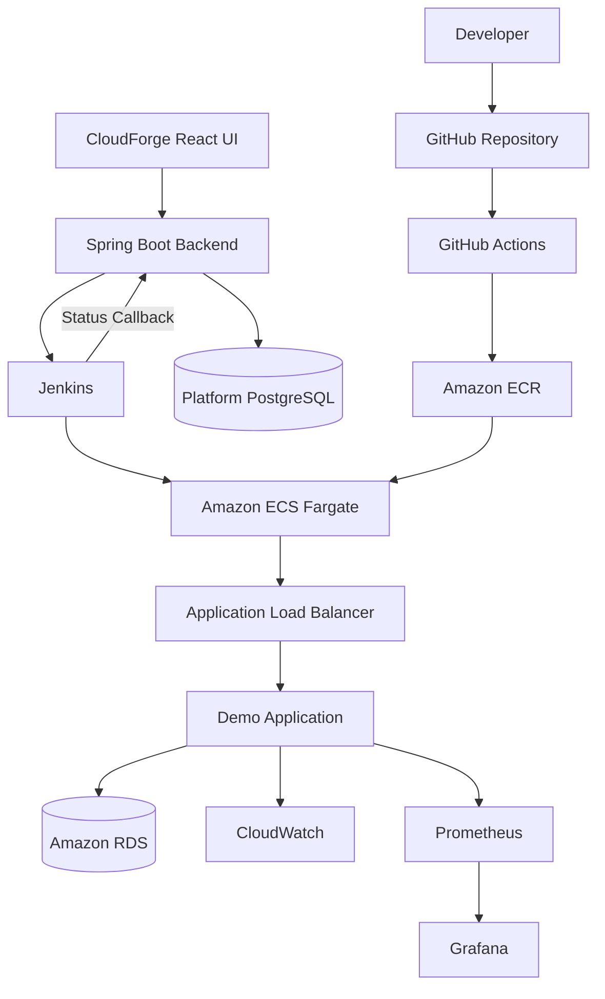

# CloudForge

CloudForge, uygulamaların **CI/CD, deployment, izleme ve rollback** süreçlerini tek bir kontrol panelinden yönetmek için geliştirilmiş bir DevOps / Cloud bitirme projesidir.

## Ne Yapıyor?

CloudForge ile:

- Uygulama kaydı oluşturulabilir.
- Git SHA ile deployment başlatılabilir.
- GitHub Actions ile test, build ve güvenlik kontrolleri çalıştırılabilir.
- Docker image Amazon ECR'a gönderilebilir.
- Jenkins üzerinden Amazon ECS Fargate deployment yapılabilir.
- Deployment durumu timeline üzerinden takip edilebilir.
- Başarılı deployment'lara rollback yapılabilir.
- Prometheus, Grafana ve CloudWatch ile sistem gözlemlenebilir.

## Kullanılan Teknolojiler

**Backend:** Java 21, Spring Boot, PostgreSQL
**Frontend:** React, TypeScript, Vite
**DevOps / Cloud:** Docker, Docker Compose, GitHub Actions, Jenkins, Terraform, AWS ECS Fargate, ECR, ALB, RDS, IAM, GitHub OIDC, CloudWatch
**Security / Monitoring:** Trivy, Checkov, TFLint, Prometheus, Grafana

## Mimari



Detaylı açıklama: [`docs/architecture.md`](docs/architecture.md)

## Repository Yapısı

```text
cloudforge/
├── apps/
│   ├── demo-app/
│   ├── platform-backend/
│   └── platform-frontend/
├── infrastructure/
│   ├── terraform/
│   ├── jenkins/
│   └── monitoring/
├── scripts/
├── docs/
├── .github/workflows/
└── docker-compose.platform.yml
```

## Deployment Akışı

```text
Developer
   ↓
GitHub
   ↓
GitHub Actions
   ↓
Test / Build / Security
   ↓
Amazon ECR
   ↓
CloudForge UI
   ↓
Spring Boot Backend
   ↓
Jenkins
   ↓
Amazon ECS Fargate
   ↓
Application Load Balancer
   ↓
Application
```

Jenkins deployment sonucunu CloudForge backend'e callback olarak gönderir.

Timeline örneği:

```text
REQUESTED
↓
STARTED
↓
JENKINS_TRIGGERED
↓
STARTED
↓
SUCCEEDED / FAILED
```

## Local Çalıştırma

```bash
make platform-up
make platform-ps
make platform-smoke
make platform-down
```

Frontend: `http://localhost:3000`
Backend: `http://localhost:8090`

## Testler

Backend:

```bash
mvn -f apps/platform-backend/pom.xml clean test
```

Frontend:

```bash
npm --prefix apps/platform-frontend ci
npm --prefix apps/platform-frontend run build
```

Terraform:

```bash
make -C infrastructure/terraform dev-plan
```

## Güvenlik

Projede GitHub OIDC, IAM, Security Groups, Private RDS, Trivy, Checkov, TFLint ve immutable ECR image tagleri kullanılmaktadır.

## Monitoring

Demo uygulaması Spring Boot Actuator, Prometheus, Grafana ve CloudWatch ile izlenebilir.

Health: `/actuator/health`
Metrics: `/actuator/prometheus`

## Kanıtlar

Final test ekran görüntüleri:

```text
docs/evidence/final/
```

## Bilinen Sınırlamalar

Bu proje eğitim ve bitirme projesi kapsamında geliştirilmiştir.

İleride geliştirilebilecek alanlar:

- Kullanıcı authentication / authorization
- Jenkins için daha sıkı IAM yetkilendirmesi
- HTTPS / ACM
- Gelişmiş rollback politikaları
- Multi-tenant yapı
- Staging ve Production otomasyonunun genişletilmesi

## Durum

CloudForge final doğrulama ve teslim aşamasındadır.
