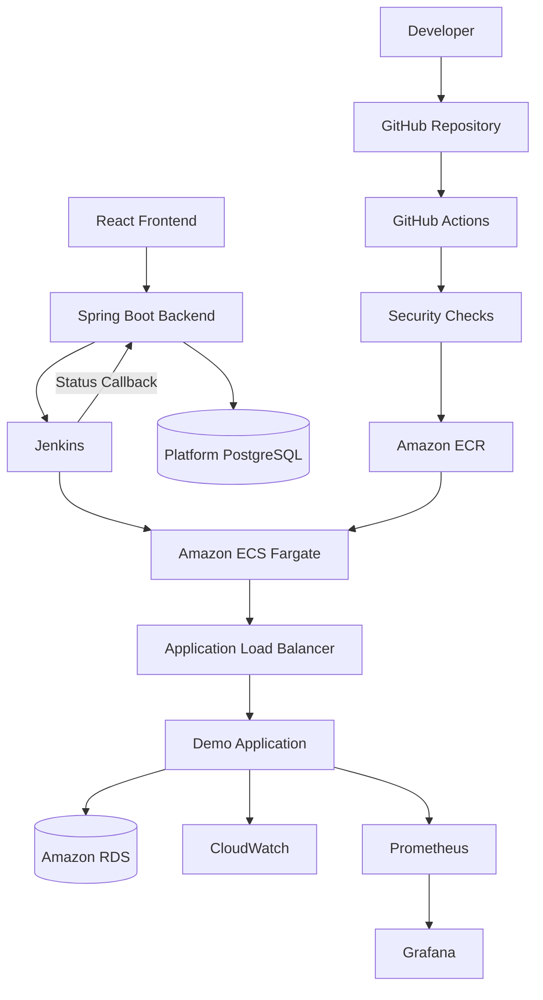

# CloudForge Mimarisi

CloudForge iki ana bölümden oluşur:

1. **Control Plane**
2. **AWS Workload Plane**

## Genel Mimari



## Control Plane

**Frontend**
- Application registry
- Deployment başlatma
- Deployment history
- Timeline
- Rollback

**Backend**
- Application kayıtları
- Deployment kayıtları
- Deployment eventleri
- Jenkins entegrasyonu
- Callback yönetimi
- Rollback orchestration

## AWS Workload Plane

Temel servisler:

- Amazon ECR
- Amazon ECS Fargate
- Application Load Balancer
- Amazon RDS
- CloudWatch

## Deployment Akışı

```text
1. Kod GitHub'a gönderilir.
2. GitHub Actions test, build ve security kontrollerini çalıştırır.
3. Docker image Git SHA ile Amazon ECR'a gönderilir.
4. Kullanıcı CloudForge UI'dan deployment başlatır.
5. Backend Jenkins'i tetikler.
6. Jenkins image'ı ECR'da doğrular.
7. Jenkins ECS deployment gerçekleştirir.
8. Health ve version kontrolleri yapılır.
9. Jenkins sonucu CloudForge'a callback ile bildirir.
10. Deployment sonucu ve timeline PostgreSQL'de saklanır.
```

## Temel Prensip

```text
Git Commit SHA
=
ECR Image Tag
=
ECS Task Definition Image
=
Çalışan Application Version
```
