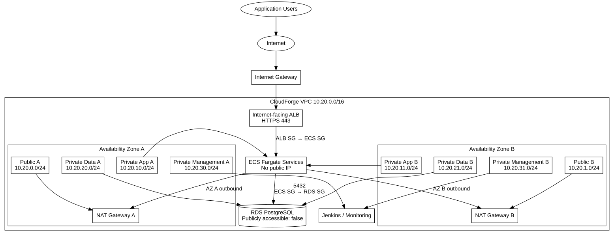

# AWS Network Architecture

## Doküman bilgisi

| Alan | Değer |
|---|---|
| Proje | CloudForge |
| Doküman | AWS Network Architecture |
| Sürüm | 1.0 |
| Durum | Taslak |
| İlgili görev | CF-007 |
| AWS Region | Europe (Frankfurt) — `eu-central-1` |
| Son doğrulama | 31 Temmuz 2026 |

## 1. Amaç

Bu doküman CloudForge platformu ve CloudForge üzerinden deploy edilen uygulamalar için kullanılacak AWS ağ mimarisini tanımlar.

Mimari iki profil sunar:

1. **Production-like profile:** Ağ izolasyonu ve yüksek erişilebilirlik önceliklidir.
2. **Cost-saving development profile:** Öğrenci bütçesinde geliştirme ve demo yapılabilmesi önceliklidir.

Her iki profilde de RDS doğrudan internete açılmaz.

## 2. Temel kararlar

- Tek AWS Region: `eu-central-1`.
- VPC en az iki Availability Zone'a yayılacak.
- Internet-facing ALB iki public subnet kullanacak.
- Production-like profilde ECS Fargate task'ları private application subnetlerinde çalışacak.
- RDS yalnızca private data subnetlerinde bulunacak.
- Security Group kuralları mümkün olduğunca Security Group referansı kullanacak.
- İlk sürüm IPv4 olacak; dual-stack daha sonra değerlendirilecek.

## 3. Production-like mimari



```text
Application User
        ↓ HTTPS 443
Internet-facing ALB
        ↓ Application port
ECS Fargate task
        ↓ PostgreSQL 5432
RDS PostgreSQL
```

ECS task'ları public IP almaz. Task Security Group yalnızca ALB Security Group'tan gelen uygulama portunu kabul eder.

## 4. VPC ve subnet planı

Ana VPC:

```text
10.20.0.0/16
```

| Katman | AZ A | AZ B | Amaç |
|---|---|---|---|
| Public | `10.20.0.0/24` | `10.20.1.0/24` | ALB ve NAT Gateway |
| Private Application | `10.20.10.0/24` | `10.20.11.0/24` | ECS Fargate task'ları |
| Private Data | `10.20.20.0/24` | `10.20.21.0/24` | RDS DB subnet group |
| Private Management | `10.20.30.0/24` | `10.20.31.0/24` | Jenkins ve monitoring |
| Reserved | `10.20.40.0/24`–`10.20.49.0/24` | — | Gelecekteki servisler |

## 5. Public subnetler

Public subnetlerde:

- Internet-facing ALB node'ları
- Production-like profilde NAT Gateway'ler
- Yalnızca cost-saving profilde public IP alan ECS task'ları

bulunabilir.

Public route table:

| Destination | Target |
|---|---|
| `10.20.0.0/16` | `local` |
| `0.0.0.0/0` | Internet Gateway |

## 6. Private application subnetleri

Production-like profilde:

```text
assign_public_ip = false
```

AZ A private application route table:

| Destination | Target |
|---|---|
| `10.20.0.0/16` | `local` |
| `0.0.0.0/0` | NAT Gateway A |
| S3 prefix list | S3 Gateway Endpoint — etkinse |

AZ B kendi NAT Gateway'ini kullanır.

ECS task'larının ECR image pull, CloudWatch Logs ve Secrets Manager erişimi için NAT veya ilgili VPC endpointleri gerekir.

## 7. Private data subnetleri

RDS DB subnet group:

```text
10.20.20.0/24
10.20.21.0/24
```

Data route table yalnızca VPC local rotasını içerir; varsayılan internet rotası bulunmaz.

RDS ayarı:

```text
publicly_accessible = false
```

RDS Security Group yalnızca ECS Task Security Group'tan `5432/TCP` kabul eder.

## 8. Management subnetleri

Bu subnetler aşağıdaki kaynaklar için ayrılmıştır:

- Jenkins EC2
- Prometheus/Grafana yönetim bileşenleri
- Interface VPC endpoint ENI'leri
- Gelecekteki internal tooling

Jenkins UI doğrudan `0.0.0.0/0` kaynağına açılmayacaktır. SSM Session Manager, VPN veya kontrollü internal erişim kullanılacaktır.

## 9. Application Load Balancer

ALB iki public subnet kullanır ve listener planı şöyledir:

| Listener | İşlem |
|---|---|
| HTTP 80 | HTTPS 443'e redirect |
| HTTPS 443 | Host tabanlı routing |

Örnek:

```text
todo-api.cloudforge.example → todo-api target group
shop-api.cloudforge.example → shop-api target group
```

Blue-green deployment için uygulama başına iki target group kullanılabilir:

```text
todo-api-blue
todo-api-green
```

## 10. NAT stratejisi

### Production-like

Her AZ kendi NAT Gateway'ini kullanır:

```text
Private App A → NAT A
Private App B → NAT B
```

### Development

NAT Gateway maliyetini azaltmak için varsayılan development profilinde NAT oluşturulmaz. ECS task'ları public subnetlerde public IP alabilir; fakat inbound yalnızca ALB Security Group'tan kabul edilir.

Public IPv4 adreslerinin de ücretlendirmeye tabi olabileceği için gerçek maliyet AWS Pricing Calculator ile doğrulanacaktır.

## 11. VPC endpoint planı

Opsiyonel endpointler:

| Servis | Tür | Amaç |
|---|---|---|
| Amazon S3 | Gateway | ECR image layer ve S3 erişimi |
| ECR API | Interface | ECR API çağrıları |
| ECR DKR | Interface | Docker registry erişimi |
| CloudWatch Logs | Interface | Private log gönderimi |
| Secrets Manager | Interface | Private secret erişimi |
| Systems Manager | Interface | Private yönetim erişimi |

Interface endpoint'lerin de saatlik ve veri işleme maliyeti bulunduğu için NAT ile maliyet karşılaştırması yapılacaktır.

## 12. DNS

```text
enable_dns_support   = true
enable_dns_hostnames = true
```

Dış DNS Route 53 ve ACM üzerinden ALB'ye yönlendirilir. İç servis keşfi için ileride AWS Cloud Map veya ECS Service Connect değerlendirilebilir.

## 13. VPC Flow Logs

Production-like profilde VPC Flow Logs etkinleştirilebilir.

Kullanım amaçları:

- Reddedilen bağlantıları incelemek
- Security Group hata ayıklamak
- Network trafik kanıtı üretmek
- Güvenlik raporunu desteklemek

## 14. Etiketleme

```text
Project     = CloudForge
Environment = development | staging | production
Layer       = public | application | data | management
ManagedBy   = Terraform
Owner       = Samet
```

## 15. Kabul kriterleri

- [ ] VPC iki Availability Zone'u kapsamalıdır.
- [ ] ALB iki public subnet kullanmalıdır.
- [ ] Production ECS task'ları public IP almamalıdır.
- [ ] RDS public olmamalıdır.
- [ ] RDS DB subnet group iki AZ subneti içermelidir.
- [ ] ECS inbound yalnızca ALB Security Group'tan gelmelidir.
- [ ] RDS inbound yalnızca ECS Security Group'tan gelmelidir.
- [ ] Public ve private route table'lar ayrılmalıdır.
- [ ] Development ve production-like profilleri Terraform değişkenleriyle seçilebilmelidir.
- [ ] Ağ kaynakları standart tag'lere sahip olmalıdır.
