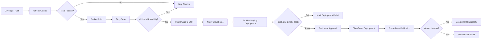

# CI/CD Workflow

## İlgili görev

**CF-008 — Create CI/CD workflow diagram**

## Sorumluluk ayrımı

| Araç | Sorumluluk |
|---|---|
| GitHub Actions | Test, build, Docker image üretimi, güvenlik taraması ve ECR push |
| Jenkins | Staging deployment, doğrulama, production deployment ve rollback |
| CloudForge Backend | Deployment kaydı, pipeline tetikleme ve durum takibi |
| Prometheus | Production doğrulama metrikleri |
| Amazon ECR | Değiştirilemez deployment artifact'larını saklama |

## Ana akış



## Branch davranışı

| Branch | Çalışacak işlemler |
|---|---|
| `feature/*` | Test ve kod kalite kontrolü |
| `develop` | Test, Docker build ve staging adayı |
| `main` | Test, scan, ECR push ve production adayı |

## Pipeline engelleme kuralları

Deployment aşağıdaki durumlarda devam etmez:

- Unit veya integration test başarısızsa
- Docker image oluşturulamıyorsa
- Kritik güvenlik açığı bulunursa
- `.cloudforge.yml` geçersizse
- Image ECR'a gönderilemezse
- Staging health check başarısızsa

## Image sürümleme

Her image en az commit SHA ile etiketlenir:

```text
cloudforge-demo-app:a84f92d
```

Production deployment kaydı ayrıca image digest ve ECS task definition revision bilgisini saklar.
