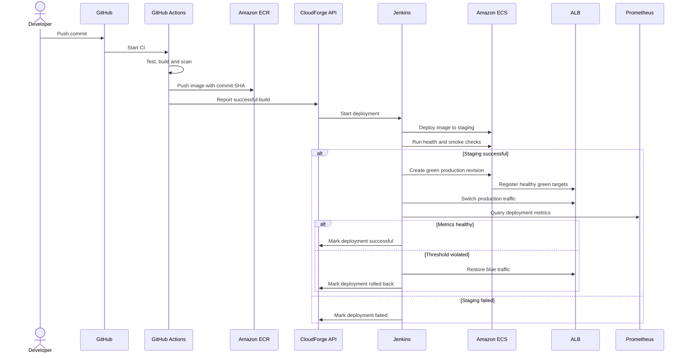

# Deployment Sequence

## Kritik tasarım kuralları

- CI başarısızsa CD başlamaz.
- Staging doğrulanmadan production deployment yapılmaz.
- Production trafik geçişi health check sonrası yapılır.
- Rollback hedefi image tag yerine mümkün olduğunda image digest ve task definition revision ile tanımlanır.
- Her çağrıda deployment ID taşınır.
