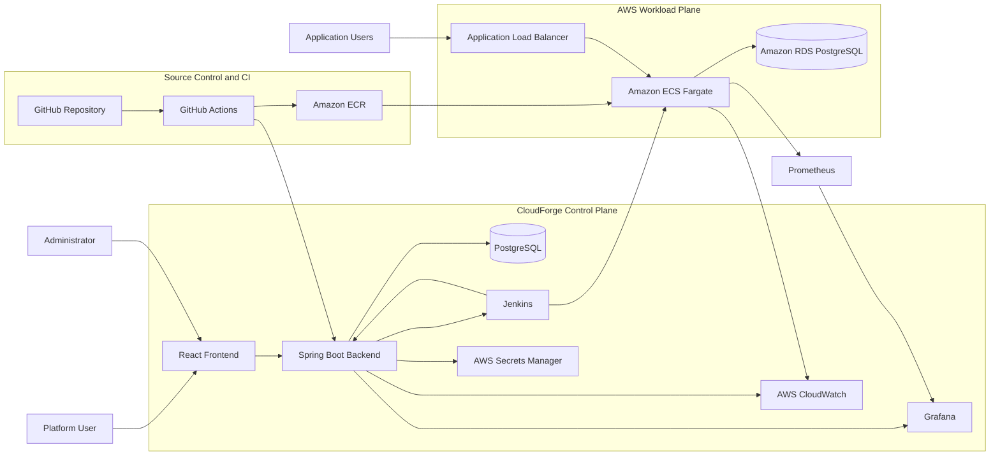

# High-Level System Architecture

## Doküman bilgisi

| Alan | Değer |
|---|---|
| Proje | CloudForge |
| Doküman | Üst Seviye Sistem Mimarisi |
| Sürüm | 1.0 |
| Durum | Taslak |
| İlgili görev | CF-006 |

## 1. Amaç

Bu doküman CloudForge platformunun ana bileşenlerini, bileşen sorumluluklarını ve sistemler arası temel veri akışlarını tanımlar.

CloudForge iki farklı çalışma alanından oluşur:

1. **Control Plane:** Kullanıcıların uygulama, deployment, secret ve monitoring işlemlerini yönettiği CloudForge platformu.
2. **Workload Plane:** Kullanıcı uygulamalarının Amazon ECS Fargate üzerinde çalıştığı alan.

Bu ayrım, platform yönetim servisleri ile deploy edilen uygulamaların sorumluluklarını ve güvenlik sınırlarını belirgin hale getirir.

## 2. Mimari hedefler

CloudForge mimarisi aşağıdaki hedefleri karşılamalıdır:

- Tekrar üretilebilir AWS altyapısı
- CI ve CD sorumluluklarının ayrılması
- Kullanıcı uygulamalarının birbirinden bağımsız çalışması
- Deployment süreçlerinin izlenebilir olması
- Hatalı deployment sonrası rollback yapılabilmesi
- Secret bilgilerinin kaynak koddan ayrılması
- Uygulama ve altyapı metriklerinin merkezi izlenmesi
- Projenin tek geliştirici tarafından uygulanabilir kalması
- Daha sonra yeni deployment stratejilerinin eklenebilmesi

## 3. Ana mimari


GitHub Mermaid görünümü:



## 4. Control Plane

Control Plane, CloudForge’un yönetim ve otomasyon katmanıdır.

### 4.1 React Frontend

Sorumlulukları:

- Kullanıcı ve yönetici arayüzlerini sunmak
- Uygulama oluşturma formunu göstermek
- Deployment geçmişini ve durumlarını göstermek
- Log, alarm ve monitoring bağlantılarını göstermek
- Rollback ve kritik işlemler için kullanıcı onayı almak
- Backend REST API ile haberleşmek

Frontend doğrudan AWS, Jenkins veya veritabanına erişmez.

### 4.2 Spring Boot Backend

CloudForge backend ilk sürümde **modüler monolith** olarak geliştirilecektir.

Planlanan modüller:

```text
authentication
users
applications
repositories
provisioning
deployments
secrets
monitoring
alerts
audit
integrations
```

Backend sorumlulukları:

- Authentication ve authorization
- Uygulama kayıtlarını yönetme
- Repository yapılandırmasını doğrulama
- Jenkins pipeline’larını tetikleme
- GitHub Actions ve Jenkins sonuçlarını alma
- Deployment durum makinesini yönetme
- Secret metadata bilgilerini tutma
- Monitoring ve log bağlantıları sağlama
- Audit kayıtları oluşturma

Backend, uzun süren Terraform veya deployment işlemlerini kendi request thread’i içinde çalıştırmaz. Bu işlemler Jenkins’e devredilir.

### 4.3 CloudForge PostgreSQL

Platform veritabanı şu tür bilgileri saklar:

- Kullanıcılar
- Uygulamalar
- Repository bilgileri
- Deployment kayıtları
- Deployment aşamaları
- Alarm kayıtları
- Audit kayıtları
- Secret isimleri ve AWS ARN değerleri

Gerçek secret değerleri CloudForge veritabanında saklanmaz.

### 4.4 Jenkins

Jenkins CloudForge’un Continuous Deployment ve provisioning motorudur.

Sorumlulukları:

- Terraform validation, plan ve apply
- Uygulama altyapısı provisioning
- Staging deployment
- Health ve smoke testleri
- Production deployment
- Blue-green trafik geçişi
- Manuel ve otomatik rollback
- Pipeline sonucunu CloudForge backend’e bildirme

### 4.5 Monitoring arayüzü

CloudForge kullanıcı arayüzü doğrudan tam bir monitoring sistemi geliştirmeye çalışmaz.

İlk sürümde:

- Özet metrikler CloudForge panelinde gösterilebilir.
- Ayrıntılı inceleme için Grafana dashboard bağlantısı sunulur.
- Uygulama logları CloudWatch bağlantısı veya sınırlı API entegrasyonu ile açılır.

## 5. Source Control ve CI

### 5.1 GitHub Repository

Deploy edilecek repository aşağıdaki sözleşmeye uyar:

```text
Dockerfile
.cloudforge.yml
health endpoint
metrics endpoint
test komutları
```

### 5.2 GitHub Actions

Sorumlulukları:

- Checkout
- Test
- Build
- Docker image oluşturma
- Vulnerability taraması
- Amazon ECR push
- CloudForge’a CI sonucu gönderme
- Jenkins deployment pipeline’ını veya CloudForge deployment API’sini tetikleme

GitHub Actions production ortamında doğrudan trafik değiştirme sorumluluğuna sahip değildir.

### 5.3 Amazon ECR

ECR immutable deployment artifact deposudur.

Örnek image etiketleri:

```text
todo-api:a84f92d
todo-api:v1.2.0
```

Deployment kayıtları commit SHA ve image digest ile ilişkilendirilmelidir.

## 6. Workload Plane

### 6.1 Amazon ECS Fargate

Her kullanıcı uygulaması bağımsız ECS service olarak çalışır.

Bir uygulamanın temel kaynakları:

- ECR repository
- ECS task definition
- ECS service
- CloudWatch Log Group
- Target group
- ALB routing rule
- Auto Scaling policy
- Secret referansları

Bir uygulamanın deployment veya scaling işlemi başka uygulamanın ECS service’ini değiştirmemelidir.

### 6.2 Application Load Balancer

ALB:

- İnternet trafiğini karşılar
- Host veya path bazlı routing uygular
- ECS target health kontrolü yapar
- Blue ve green target group’lar arasında trafik geçirir
- HTTPS sonlandırması yapar

Örnek:

```text
todo-api.cloudforge.example  -> todo-api target group
shop-api.cloudforge.example  -> shop-api target group
```

### 6.3 Uygulama veritabanı

Demo uygulama için ayrı Amazon RDS PostgreSQL kullanılacaktır.

CloudForge platform veritabanı ile kullanıcı uygulamasının veritabanı mantıksal olarak ayrıdır.

İlk geliştirme ortamında maliyet nedeniyle aynı RDS instance içinde ayrı database kullanılması değerlendirilebilir; production-like mimaride ayrım korunmalıdır.

## 7. Observability

### Prometheus

- Uygulama metrics endpoint’lerini scrape eder.
- Request rate, error rate ve latency metriklerini toplar.
- Otomatik rollback kararlarında kullanılabilecek sorgular sağlar.

### Grafana

- Application overview
- Infrastructure
- Deployment
- JVM
- Alert dashboard’larını gösterir.

### CloudWatch

- ECS container loglarını saklar.
- ALB ve ECS AWS metriklerini sağlar.
- Jenkins ve CloudForge tarafından hata incelemede kullanılır.

## 8. Temel veri akışları

### Uygulama oluşturma

```text
User
 -> React
 -> Spring Boot API
 -> PostgreSQL
```

### CI akışı

```text
Developer push
 -> GitHub
 -> GitHub Actions
 -> Tests
 -> Docker build
 -> Security scan
 -> Amazon ECR
 -> CloudForge build result
```

### Deployment akışı

```text
CloudForge
 -> Jenkins
 -> ECS staging
 -> Health check
 -> Production blue-green
 -> Prometheus verification
 -> CloudForge result update
```

### Uygulama trafiği

```text
Application User
 -> HTTPS
 -> Application Load Balancer
 -> Healthy ECS task
 -> Application database
```

## 9. Mimari sınırlar

### CloudForge’un yaptığı işler

- Deployment sürecini yönetir
- AWS kaynaklarını provision eder
- Durum ve geçmiş bilgisini tutar
- Rollback ve monitoring entegrasyonu sağlar

### CloudForge’un yapmadığı işler

- Kullanıcının kaynak kodunu otomatik düzeltmez
- Her programlama dilini otomatik algılamaz
- Uygulamaya özel veritabanı şeması oluşturmaz
- Tam özellikli Git hosting sistemi değildir
- Tam özellikli log analytics ürünü değildir
- AWS dışındaki cloud sağlayıcılarını ilk sürümde desteklemez

## 10. Ana hata noktaları

| Hata noktası | Etki | İlk çözüm yaklaşımı |
|---|---|---|
| GitHub Actions başarısız | Image oluşmaz | Deployment engellenir |
| ECR push başarısız | Image kullanılamaz | CI başarısız işaretlenir |
| Jenkins erişilemez | Deployment başlamaz | Retry ve bağlantı alarmı |
| Terraform apply başarısız | Kısmi altyapı | State korunur, tekrar planlanır |
| ECS health check başarısız | Yeni sürüm trafik alamaz | Deployment durdurulur |
| Metrik eşiği aşılır | Kullanıcı hatası riski | Otomatik rollback |
| Prometheus erişilemez | Metrik doğrulaması yapılamaz | Deployment politikaya göre durdurulur |
| CloudForge DB erişilemez | Yönetim işlemleri durur | Backup ve recovery planı |
