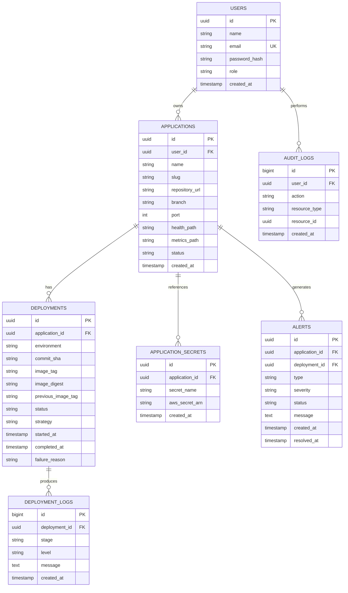
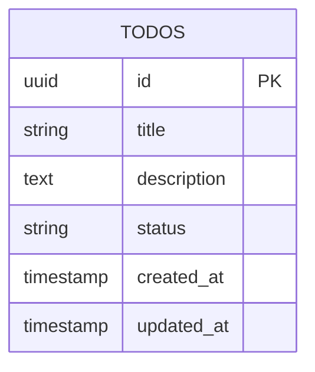

# Database Design

## İlgili görev

**CF-009 — Design database ER diagram**

CloudForge platform veritabanı ile deploy edilen demo uygulamasının veritabanı birbirinden ayrıdır.

## CloudForge platform modeli

## Demo application modeli

İlk kodlayacağımız demo uygulama yalnızca `todos` tablosunu kullanır:

Platform veritabanında gerçek secret değeri tutulmaz. Yalnızca AWS Secrets Manager ARN bilgisi saklanır.
